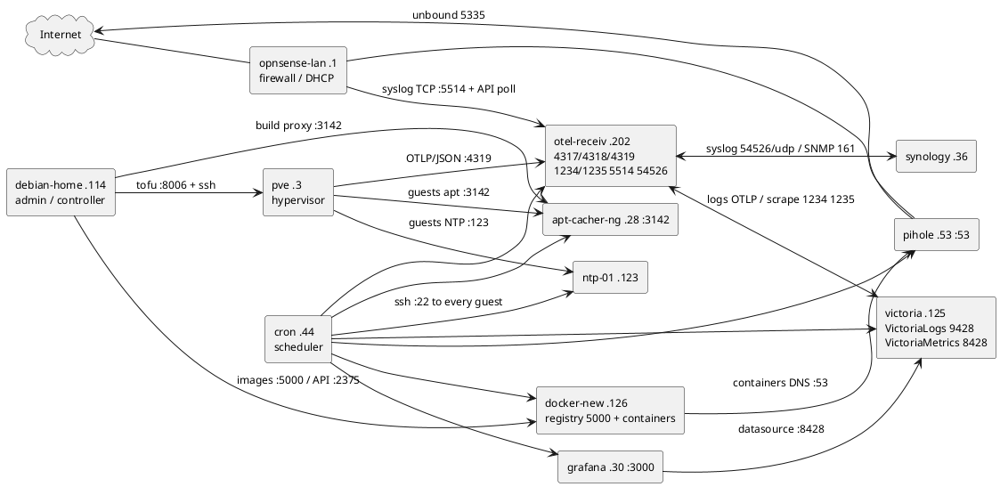
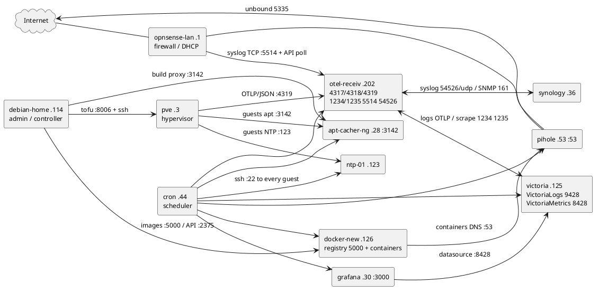

# Fleet — hosts, guests, containers, services and links

Home lab on a single LAN: `192.168.2.0/24`, domain `intranet.local`.

**Baseline**

| Item | Value |
|------|-------|
| Gateway / router / DHCP | `opnsense-lan` — `192.168.2.1` (OPNsense firewall) |
| DNS (LAN resolver) | Pi-hole `192.168.2.53` (LXC) → unbound `127.0.0.1:5335` → internet |
| NTP server | `ntp-01` — `192.168.2.123` (NTPsec, serves `192.168.2.0/24`) |
| apt cache | `apt-cacher-ng` — `192.168.2.28:3142` (every Debian 12/13 guest) |
| Address plan | LAN guests `192.168.2.28`–`.126` and `.202`; Docker internals `172.22/16`, `172.42/16`, `172.94/16` |
| Sources of truth | `git/tofu` (VMs/LXCs), `git/ansible` (services), `git/docker` (containers) |

The guest list and the addresses are a **snapshot**: re-derive them from the repositories
with `my_warp.sh --lib tofu tofu_output` and `my_warp.sh --lib ansible inventory_tofu`, which
win over this document whenever they disagree.

`inventory/home` and `inventory/standalone` describe older fleets and are not this one.

Reading the fleet's data: Grafana (`192.168.2.30:3000`) needs its own login — still the
packaged `admin`/`admin` unless it was changed — while VictoriaLogs (`:9428`) and
VictoriaMetrics (`:8428`) answer without any authentication.

---

## 1. Hosts

| Host | Address | Role |
|------|---------|------|
| `pve` | `192.168.2.3` | Proxmox VE 9.2 hypervisor |
| `synology` | `192.168.2.36` | NAS (DS413j, DSM 6.2) |
| `debian-home` | `192.168.2.114` | Admin / dev workstation |
| `opnsense-lan` | `192.168.2.1` | Firewall / router |

- **`pve`** — Proxmox VE 9.2, the only hypervisor.
  - Hosts the 3 VMs of §2 and the 4 unprivileged LXCs of §3.
  - API on `:8006` driven by OpenTofu from `debian-home`; SSH for the cloud-init snippets.
  - Its OTel metric server posts node/VM/CT/storage metrics to `otel-receiv:4319`, every 10 s.
  - It also runs the ordinary `otelcol-contrib` agent (group `proxmox`), so its journal —
    the only record of `pveproxy`, `pvedaemon`, `pvestatd` and ssh — is in the log database.
- **`synology`** — NAS of the lab (DS413j, DSM 6.2, ARM v5: nothing is installed on it).
  - NFS export `/volume1/Download`, mounted by the media containers (`transmission`, `sabnzbd`, `sonarr`).
  - Polled over SNMP v2c every 30 s by `otel-receiv`; pushes its DSM logs to `otel-receiv:54526/udp`.
- **`debian-home`** — admin and development workstation (this machine).
  - Holds the three git repos and runs ECA; is the Ansible controller (its wrapper decrypts the `.gpg` configs).
  - Runs the `tofu` client that drives `pve`, and the `docker`/Portainer client of `docker-new:2375`.
  - Docker + buildx: builds the `jinade_*` images and pushes them into the registry of `docker-new`.
- **`opnsense-lan`** — firewall, LAN gateway, DHCP server and DNS forward.
  - Pushes its firewall logs to `otel-receiv:5514/tcp` (remote syslog target, TCP).
  - Polled over its HTTPS API by the `opnsense2otel` exporter that runs on `otel-receiv`.

---

## 2. VMs in pve (`tofu_vms`)

Managed by OpenTofu (`git/tofu`): Debian 13 cloud image + cloud-init snippets, one VM per tag.

| VM | Address | CPU / RAM / disk | Tag |
|----|---------|------------------|-----|
| `ntp-01` | `192.168.2.123` | 2 / 1 GiB / 20 GB | `ntp_server` |
| `victoria` | `192.168.2.125` | 2 / 3 GiB / 20 GB | `victoria_suite` |
| `docker-new` | `192.168.2.126` | 4 / 5 GiB / 20 GB | `docker_server` |

- **`ntp-01`** — the time server of the LAN.
  - NTPsec on `udp/123`, serving `192.168.2.0/24`; every other guest syncs to it.
  - Containers follow the clock of their node and do not query it.
- **`victoria`** — the observability databases of the fleet.
  - VictoriaLogs `:9428`: all the logs, searched in `/select/vmui/`, 90 days of retention.
  - VictoriaMetrics `:8428`: all the metrics, dashboards and `vmui`; scrapes `otel-receiv` `:1234`/`:1235`.
  - Two `vmalert` instances (one for the log rules, one for the metric ones), no notifier configured.
  - Everything is served without TLS and without authentication: only the LAN reaches it.
- **`docker-new`** — Docker engine host; runs the container fleet of §4.
  - Docker API on `tcp/2375` — unauthenticated and root-equivalent, bound to `192.168.2.126` only.
  - Holds the private registry (`:5000`) and Portainer (`:9000`), both described in §4.
  - Its OTel agent also ships the container logs and the container statistics (`docker_stats`).

---

## 3. LXCs in pve (`tofu_cts`)

Unprivileged Debian 13 containers, one per role, ids 121–124 and 126 (configured in `git/tofu`).

| LXC | Address | CPU / RAM / disk | Tag |
|-----|---------|------------------|-----|
| `apt-cacher-ng` | `192.168.2.28` | 1 / 512 MiB / 8 GB | `apt_cacher` |
| `pihole` | `192.168.2.53` | 2 / 512 MiB / 4 GB | `pihole_server` |
| `otel-receiv` | `192.168.2.202` | 1 / 1 GiB / 8 GB | `otel_receiv` |
| `grafana` | `192.168.2.30` | 2 / 1 GiB / 8 GB | `grafana_server` |
| `cron` | `192.168.2.44` | 2 / 512 MiB / 8 GB | `cron_server` |

- **`apt-cacher-ng`** — apt proxy of the lab, `:3142`.
  - Every Debian 12/13 guest fetches its indexes and `.deb` through it (http, `HTTPS///` rewriting).
  - Also serves the pinned GitHub releases: OTel collector, Grafana, Victoria stack, the exporters.
- **`pihole`** — DNS resolver of the LAN, `:53`.
  - Pi-hole v6 with unbound on `127.0.0.1:5335` as its only upstream (no public resolver queried directly).
  - Publishes the `intranet.local` names of the whole fleet, plus the hosts OpenTofu does not manage.
  - Web interface served by FTL with its own self-signed certificate.
- **`otel-receiv`** — receiver of the fleet (otelcol-contrib), the hub of §5.
  - OTLP in: `:4317` gRPC and `:4318` http for the agents, `:4319` http (JSON) for `pve`.
  - Prometheus out: `:1234` (metrics of the fleet) and `:1235` (pve metrics, names translated).
  - Syslog in: `:5514/tcp` (opnsense) and `:54526/udp` (synology).
  - Polls the NAS over SNMP `:161` and hosts the `opnsense2otel` and `pihole-exporter` services.
  - Reads its own journal and `hostmetrics` too: it appears in the dashboards like any guest.
- **`grafana`** — dashboards of the fleet, `:3000`.
  - Prometheus datasource = VictoriaMetrics `192.168.2.125:8428`.
  - Dashboards provisioned from `git/ansible`: fleet, containers, synology, opnsense, Pi-hole, proxmox-ve.
- **`cron`** — the scheduler of the lab: the one guest whose jobs reach every other one.
  - Runs `git`, `openssh-client` and `cron` itself; no job is deployed here, the guest is only prepared for them.
  - Holds root's RSA key pair, created once by `git/ansible` (`playbook/catalog/centralized_cron.yaml`).
  - Its public key is authorized for `root` on every guest of `tofu_vms` and `tofu_cts`: a job connects to each of them without a password.
  - Serves nothing on the LAN: its own key is how the fleet reaches it, and only its jobs use it.

---

## 4. Containers in docker (`docker-new`, `192.168.2.126`)

Images built by `git/docker` (the `jinade_*` repositories, pushed to the local registry) and
applied by `ansible/playbook/catalog/docker_server.yaml`, one Compose project per stack.

| Container | Docker network(s) → address | Port on the host |
|-----------|-----------------------------|------------------|
| `registry` | `no_internet_access` → `172.22.0.55` | `5000` |
| `portainer` | host port only | `9000` |
| `squid` | `internet_access` → `172.42.0.28` | `3128` |
| `nginx` | `no_internet_access` → `172.22.0.80` | `80`, `81`, `443` |
| `openvpn-client` | `172.42.0.94` / `172.94.0.94` | none |
| `transmission` | `172.42.0.91` / `172.94.0.91` | `9091` |
| `sabnzbd` | `172.42.0.80` / `172.94.0.80` | `8080` |
| `jackett` | `172.42.0.17` / `172.94.0.17` | `9117` |
| `nzbhydra2` | `172.42.0.76` / `172.94.0.76` | `5076` |
| `flaresolverr` | `172.42.0.92` / `172.94.0.92` | `8191` |
| `tor-privoxy` | `172.42.0.18` / `172.94.0.18` | `8118`, `9050`, `9051` |
| `sonarr` | `internet_access` only → `172.42.0.89` | `8989` |

- **`registry`** — private registry holding the `jinade_*` images the stacks pull as `localhost:5000/...`.
  - Published on the loopback (for the daemon of the host) and on `192.168.2.126:5000` (for `debian-home`).
  - No authentication: an image registry, kept off `0.0.0.0` on purpose.
- **`portainer`** — Docker management UI; the daemon socket and a named volume are mounted.
  - Its first-run setup is the one manual step of a fresh install.
- **`squid`** — forward HTTP/HTTPS proxy for the LAN, with its own generated CA certificate.
- **`nginx`** — nginx-proxy-manager: reverse proxy and TLS front-end for the lab services.
  - Sites on `:80`/`:443`, administration on `:81`; reaches host ports via `host.docker.internal`.
- **`openvpn-client`** — the VPN gateway of the container fleet.
  - Connects to the outside VPN (`NET_ADMIN`, `/dev/net/tun`) and masquerades its `tun0` interface.
  - It is the default gateway of every container that also joins `vpn_access` (see *Egress* below).
- **`transmission`** — BitTorrent client, `:9091`; downloads onto the NAS over NFS.
- **`sabnzbd`** — Usenet downloader, `:8080`; also stores onto the NAS over NFS.
- **`jackett`** — torrent indexer aggregator (Torznab), `:9117`; asks `flaresolverr` for the challenges.
- **`nzbhydra2`** — Usenet indexer aggregator (Newznab), `:5076`.
- **`flaresolverr`** — solves Cloudflare / DDoS-Guard challenges on behalf of `jackett`, `:8191`.
- **`tor-privoxy`** — Tor SOCKS proxy (`:9050`, control `:9051`) and privoxy HTTP proxy (`:8118`).
- **`sonarr`** — TV PVR orchestrator, `:8989`: drives jackett, nzbhydra2, sabnzbd and transmission.
  - It is the one service kept on the direct path, with `registry`, `squid` and `nginx`.

**Shared rules of the stack**

- **Networks** — `internet_access 172.42.0.0/16`, `no_internet_access 172.22.0.0/16` and
  `vpn_access 172.94.0.0/16`, all with the gateway `.1`; the addresses of the table are static.
- **Egress** — every container other than `openvpn-client` that holds a `vpn_access` address
  deletes its default route at startup and reinstalls it through `openvpn-client`
  (`172.94.0.94`), reading `.vpn` / `.gw` / `.route` from its volume.
  Those are `transmission`, `sabnzbd`, `jackett`, `nzbhydra2`, `flaresolverr` and `tor-privoxy`.
- **DNS** — every container queries `192.168.2.53` with `dns_search intranet.local`; the ones on
  `no_internet_access` use Docker's embedded DNS `172.22.0.1`.
- **Volumes** — one named volume per service (`sonarr`, `jackett`, `flaresolverr`, `sabnzbd`,
  `nzbhydra2`, `transmission`, `tor-privoxy`, `vpn`, plus `nginx_data` / `nginx_letsencrypt`).
- Their configuration is kept encrypted in `git/docker`; the Ansible wrapper decrypts it into the
  volumes on a first run, and a marker on the guest keeps the next runs from overwriting it.

---

## 5. Network connections





The image is rendered offline by the local PlantUML jar (no npm, no container).
Regenerate it from the directory of this document after editing the block above:

```shell
awk '/^```plantuml$/{p=1;next} /^```$/{p=0} p' fleet.md \
  | java -jar ~/plantuml/plantuml.jar -tpng -pipe > img/fleet.png
```

- The recipe is deterministic: the same block always produces the same `img/fleet.png`.
- In Emacs, `C-c C-x C-i` (`markdown-toggle-inline-images`) displays the image in the buffer.

The links of the fleet, one line each (the table covers more than the diagram):

| Link | Port / protocol | What it carries |
|------|-----------------|-----------------|
| guest → `otel-receiv` | `4317`/`4318` OTLP | journal logs and `hostmetrics` of the OTel agent of the guest |
| `pve` → `otel-receiv` | `4319` OTLP/HTTP | node, VM, container and storage metrics (JSON encoding) |
| `opnsense-lan` → `otel-receiv` | `5514/tcp` syslog | firewall logs, enriched by `opnsense2otel` |
| `synology` → `otel-receiv` | `54526/udp` syslog | DSM logs |
| `otel-receiv` → `synology` | `161/udp` SNMP v2c | disk, volume, memory, CPU and network metrics |
| `victoria` → `otel-receiv` | `1234`, `1235` | scrape of the fleet and pve metrics, one sample per minute |
| `otel-receiv` → `victoria` | `9428` OTLP | push of the logs of the fleet, into VictoriaLogs |
| `grafana` → `victoria` | `8428` | Prometheus datasource of every dashboard |
| guest → `apt-cacher-ng` | `3142` | apt indexes and `.deb`, plus the pinned GitHub releases |
| guest → `pihole` | `53` | DNS of the LAN and the `intranet.local` names |
| guest → `ntp-01` | `123/udp` | time |
| `debian-home` → `pve` | `8006` + SSH | OpenTofu (API token) and the cloud-init snippet upload |
| `debian-home` → `docker-new` | `5000`, `2375`, `9000` | image push, Docker API, Portainer |
| `debian-home` → `apt-cacher-ng` | `3142` | `HTTP_PROXY` used while building the `jinade_*` images |
| container → `pihole` | `53` | DNS of the containers |
| VPN-bound container → `openvpn-client` | `172.94.0.94` | default gateway: the internet egress of these containers |
| `transmission`, `sabnzbd`, `sonarr` → `synology` | NFS | `192.168.2.36:/volume1/Download`, mounted with autofs |
| `cron` → every guest | `22` SSH | the centralized jobs of the lab: the key of the `cron` guest is authorized for `root` on every guest of `tofu_vms` and `tofu_cts` |
| LAN client → services | `3000`, `9428`, `8428`, ports of §4 | dashboards and service UIs; databases have no auth nor TLS |
